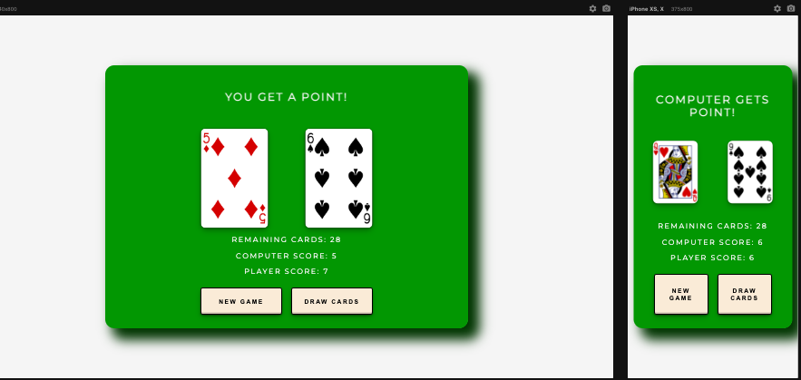

## Table of contents

- [Overview](#overview)
  - [Screenshot](#screenshot)
  - [Links](#links)
  - [Built with](#built-with)
- [Author](#author)

## Overview

### Card game using Deck of Cards API

- Two cards are drawn simultaneously and either the player or computer get a point based on who gets the highest card. When the deck ends (remaining cards: 0), the side with the most points wins.

### Screenshot

### Links

[Click Here For Live Site URL]()

### Built with

- Semantic HTML5 markup
- CSS custom properties
- Flexbox
- JavaScript

## Author

- Frontend Mentor - [@estebanp2022](https://www.frontendmentor.io/profile/estebanp2022)
